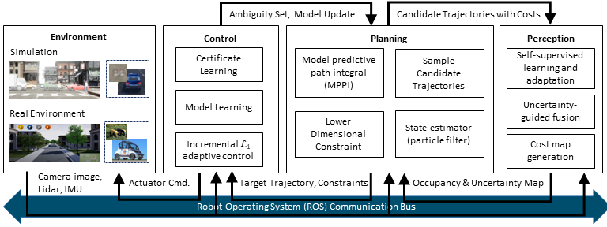

## Software in the loop (STIL) Simulations for Autonomous Vehicles

### We aim to develop STIL simulations where we can test autonomous vehicle software stacks illustrated below.

  

### We integrated AIRSIM (https://www.microsoft.com/en-us/ai/autonomous-systems-project-airsim), which uses Unreal Game Engine (https://www.unrealengine.com) to generate a photo-realistic environment, and GAZEBO (within PX4 development at https://docs.px4.io/main/en/simulation/gazebo.html), which has physics engines for customizable vehicle dynamic models.

  

### The following animated images show a vehicle in an AIRSIM environment that has a pose calculated from GAZEBO. The GAZEBO simulator is run as SITL with PX autopilot that can be customized for low-level control development. And the perception and the planning algorithm will be implemented as ROS nodes, as illustrated in the above diagrams.

